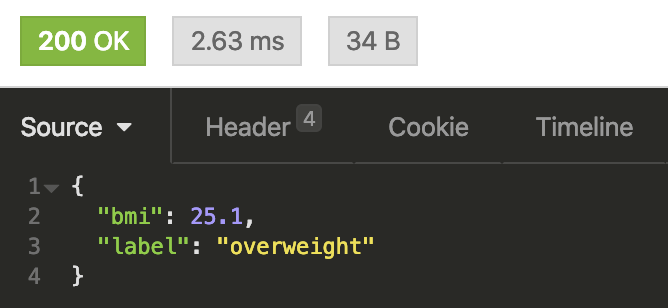

# Simple App | Body-Mass Index (BMI)
Exercise to make program Body-Mass Index (BMI) with Flask in Python. :D

Rumus:
```
bmi = kg/m^2
```

## Method-1: Run this Program in Localhost
First, you must install some of library in `requirements.txt` using `python-pip`:
```
pip install -r requirements.txt
```
Then, run:
```
python3 app.py
```
Output:
```
 * Serving Flask app "app" (lazy loading)
 * Environment: production
   WARNING: This is a development server. Do not use it in a production deployment.
   Use a production WSGI server instead.
 * Debug mode: off
 * Running on http://0.0.0.0:5000/ (Press CTRL+C to quit)
```

## Method-2: Dockerize this Apps (Run inside Docker Container)
You can dockerize this app with following command, btw i use `python:3.8-alpine`. You can see or custome image in `Dockerfile`:
```
docker build -t bmi:v1 . --no-cache
```
and, Run:
```
docker run -d --rm --name bmi -p 5000:5000 bmi:v1
```

## Verify
To verify the program running, try with accessing the url like this: `http://localhost:5000/?height=167&weight=70` and you can custom value `heigh` and `weight`. If there are bug, please info me. :D

Output:

